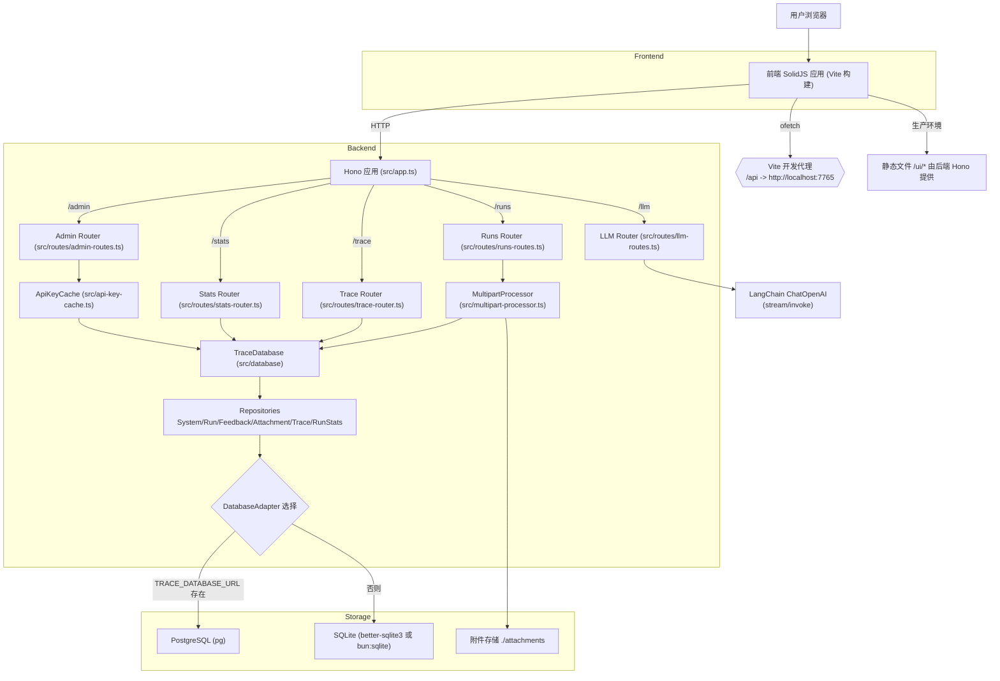

## Open Smith 架构总览

`@langgraph-js/open-smith` 是一个可自部署（self-hosted）的 LangSmith 兼容追踪与可观测平台，为 AI 应用提供运行轨迹（trace）、运行数据（run）、反馈与附件的采集、查询与可视化。后端基于 Hono（Node.js/TypeScript）实现，前端基于 SolidJS + Vite 构建，数据层通过适配器模式支持 SQLite 与 PostgreSQL。

### 功能速览

-   **LangSmith 兼容**：可接入 `langgraph-js` 等产生 LangSmith 风格数据的组件。
-   **追踪与检索**：支持按系统、线程、模型、用户等维度过滤 `traces` 与 `runs`。
-   **批量/分段摄取**：支持 `/runs/multipart` 基于 FormData 的批量/分段数据上报（含 out-of-band 字段）。
-   **系统与密钥管理**：提供 `/admin` 系统管理与 API Key 管理（需 `MASTER_KEY`）。
-   **统计分析**：提供按小时聚合的运行统计 `/stats/hourly` 并前端可视化。
-   **模型测试场**：内置 Playground，调用 `/llm/invoke` 与 `/llm/stream`（SSE）进行模型对话或流式输出。

### 技术栈

-   **后端**：Node.js + TypeScript、Hono、LangChain（ChatOpenAI）、Zod。
-   **前端**：SolidJS、UnoCSS、Chart.js、Vite（开发代理与构建）。
-   **数据**：SQLite（`better-sqlite3` 或 `bun:sqlite`）与 PostgreSQL（`pg`），通过 `DatabaseAdapter` 适配。

### 系统架构图

### 目录与关键模块

#### 后端（`/src`）

-   `src/index.ts`：启动服务器，端口默认 `7765`，优雅关闭。
-   `src/app.ts`：创建 Hono 应用、初始化数据库、挂载路由与静态资源 `/ui/*`。
-   路由层（`src/routes`）：
    -   `runs-routes.ts` (`/runs`)：批量/分段摄取接口（`/batch`、`/multipart`），对接 `MultipartProcessor`；基于 `x-api-key` 识别系统。
    -   `trace-router.ts` (`/trace`)：traces/runs 查询、线程概览、条件搜索、统计等。
    -   `stats-router.ts` (`/stats`)：按小时聚合统计查询与手动触发更新。
    -   `admin-routes.ts` (`/admin`)：系统与 API Key 管理（Bearer `MASTER_KEY`），缓存失效、迁移与引用校验等。
    -   `llm-routes.ts` (`/llm`)：模型调用（`/invoke`）、流式输出（`/stream`，SSE）。
-   数据层（`src/database`）：
    -   `BaseDatabase` 初始化表与索引（含 `run_stats_hourly`）。
    -   `TraceDatabase` 聚合各仓储（System/Run/Feedback/Attachment/Trace/RunStats）。
    -   `repositories/*`：面向表与查询的仓储实现。
    -   适配器（`src/adapters`）：`PgAdapter`、`BetterSqliteAdapter`、`BunSQLiteAdapter`。
-   摄取处理：`src/multipart-processor.ts` 搭配 `multipart-config.json`、`multipart-types.ts` 等，支持 `post.*`、`patch.*`、`feedback.*`、`attachment.*` 分段。
-   API Key 缓存：`src/api-key-cache.ts` 基于 `systems` 表缓存 `api_key -> systemName`，TTL 5 分钟。
-   类型：`src/types.ts` 定义跨前后端的 `RunRecord`、`TraceOverview`、`RunStatsHourlyRecord` 等。

#### 前端（`/frontend`）

-   入口与路由：`frontend/main.ts` 使用 `HashRouter`；`frontend/Layout.tsx` 提供侧边导航。
-   页面：
    -   `pages/app`：三栏主视图（线程/trace 列表、运行列表、运行详情）。
    -   `pages/LlmRecords`：运行记录与过滤（系统/模型/时间/用户等），点击查看详情。
    -   `pages/SystemsPage.tsx`：系统与 API Key 管理（需要在前端存入 `MASTER_KEY`）。
    -   `pages/PlayGround`：大模型测试页，调用 `/llm` 接口，支持结构化输出/工具与流式。
    -   `pages/StatsPage.tsx`：小时级统计可视化，多轴多指标展示。
-   API 封装：`frontend/api.ts` 使用 `ofetch`，开发环境 `baseURL=/api`（Vite 代理到后端），生产使用相对路径 `../`。
-   构建配置：`vite.config.ts`（端口 8367、`/api` 代理到 `http://localhost:7765`，产物输出 `dist/public`）。

#### Python 示例（`/py`）

-   `py/src/graph.py` 简单示例，展示与 LangGraph/LangChain 的结合，可配合本服务作为 LangSmith 端点。

### 运行与部署

-   开发：
    -   后端：`pnpm dev`（使用 Bun 运行 `src/index.ts`，默认端口 `7765`）。
    -   前端：`pnpm dev:fe`（Vite at `http://localhost:8367`，`/api` 代理到后端）。
-   构建与启动：
    -   `pnpm build`（编译后端 + 构建前端到 `dist/public`）。
    -   `pnpm start`（运行 `dist/index.js`，后端将同时提供 `/ui/index.html` 仪表盘）。

#### 环境变量

-   `MASTER_KEY`（必需，用于 `/admin` 路由鉴权）。
-   `TRACE_DATABASE_URL`（可选，配置后使用 PostgreSQL；不配置则默认使用 SQLite）。

### 主要数据表（简述）

-   `systems`：系统与 `api_key` 管理。
-   `runs`：运行记录（含 `trace_id`、`thread_id`、`user_id`、`model_name`、`total_tokens`、`time_to_first_token` 等）。
-   `feedback`：运行反馈（与 `run_id` 关联）。
-   `attachments`：运行附件（文件保存在 `./attachments`，表中记录元信息）。
-   `run_stats_hourly`：小时时间粒度的统计聚合。

### 请求流（简述）

1. 客户端/SDK 以 `FormData` 调用 `/runs/multipart`，后端 `MultipartProcessor` 将分段解析并写入 `TraceDatabase`；附件写入本地磁盘。
2. 前端以 `ofetch` 调用 `/trace/*`、`/stats/*` 拉取数据并可视化；
3. 管理端以 `Authorization: Bearer <MASTER_KEY>` 调用 `/admin/*` 管理系统与缓存；
4. Playground 通过 `/llm/invoke` 或 `/llm/stream` 完成模型调用与流式展示。

### 参考文件

-   启动与挂载：`src/index.ts`、`src/app.ts`
-   路由：`src/routes/*.ts`
-   数据层：`src/database/*`、`src/adapters/*`
-   摄取：`src/multipart-processor.ts`、`src/multipart-*.json|ts`
-   前端入口与页面：`frontend/main.ts`、`frontend/pages/*`
